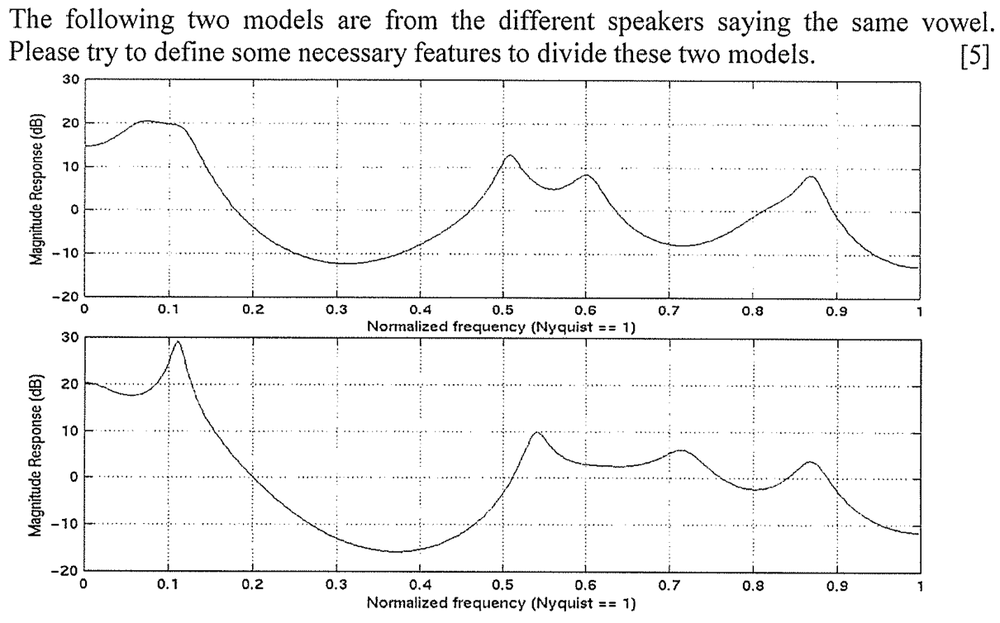

# Past Questions and Answers

Apr 29, 2017 | [Derek Mingyu MA](http://derek.ma) | <derek.ma@connect.polyu.hk>

## Knowledge Structure

### L1-2 | Introduction

### L3 | Image Processing

### L4-6| Pattern Recognition

### L7-9 | Traditional Uni-Model Techs: Physical Features

### L10 | New Biometrics Tech

### L11-12 | Traditional Uni-Model Techs: Behavioral Features

## Review Points

1. Iris vs Retina
2. Voice feature
3. Statistics-based and Knowledge-based face detection & location
4. Process: enrollment, template/feature vector and matching score
5. Euclidean distances and Hamming distances
6. Biometrics authentication: statistical, syntactic and NN
7. Feature of signature
8. PCA
9. Contrast enhancement methods: power law function
10. Fingerprint features, global and local
11. Image processing: Convolution
12. Select minimum feature vector
13. Filter operations for edge extraction: High-pass filter and Laplacian edge filter
14. face recognition process

## Past Questions: Explanations

### 1

> As you know, there are two doors used in the current E-Channel border application. The first one could need to show a personal HK ID card, and the second to obtain user's fingerprint and match with the record in the DB. If only one door to be used, how to implement this application? Please draw the necessary flowcharts to point out the common functions and the differences between these two doors and the one door E-Channel border application.

### 2

> There are two kinds of biometrics from an eye, i.e. Iris and Retina. Please define their features and explain each advantages and disadvantages.

#### Retina features
Physical features 

* vessels: blood transfer
* optic disk: the nerves of eye connected to brain

Pathological features

* red lesion
* bright lesion

#### Retina +/-

Advantages

* accuracy
* stability of biometrics Sample
* resistant to fraud
* small temple

Disadvantages

* difficulty to use
* consumer perceptions
* static design
* cost

#### Iris features

* trabecula meshwork, a tissue that gives the appearence of dividing the iris in a radial fashion
* rings
* furrows
* freckles
* corona

#### Iris +/-

Advantages

* high level of accurancy
* unique structure for each iris
* capable of reliable identification as well as verification

Disadvantages

* potentially low contrast pattern in dark irises
* some user don't accept eye-based technology
* high cost capture devices or inconvenient devices
* not easy to use since light sensitivity of humans
* accuracy decreases when users wear eyeglass, obscured by eyelashes, lenses/reflections
* any unusual lighting situations may affect the ability of the camera to acquire its subject

### 3

> The following two models are from the different speakers saying the same vowel. Please try to define some necessary features to divide these two models.

Feature set: cadence, frequency, pitch and tone of an individual's voice

### 4 

> Face detection & location is an important stage in face recognition. There are two main types, i.e., statistics-based and Knowledge-based, to implement this function. Each type could include a few methods. Could you show at least one method for each type and roughly explain how to work?

### 5

> Explain following basic concepts:
> 1) Enrollment
> 2) Template/Feature Vector
> 3) Matching Score

Enrollment:
The process by which a user's biometrics data is initially **acquired, assessed, processed and stored** in the form of a template for ongoing use in a biometrics system

Template:
A mathematical representation of biometrics data-skeletonized features of a detailed image and typical values of biometrics indicators of an individual. It update over time, which can be stored in central database, mobile devices and smart cards.

Feature Vector:
It frequently happens that we can measure a fixed set of $d$ features for any objects or event that we want to classify. We can think of our feature set as a feature vector $x$, where $x$ is the $d$-dimensional column vector. We can also think of $x$ as being a point in a $d$-dimensional feature space.

Matching scores:
The matching result between two templates

### 6

> There are two comparison methods in pattern recognition, Euclidean distances and Hamming distances, for decision making. What difference between these two distances? If given two words: "WHILE" and "WHORL", what is their Hamming distance?

### 7

> There are three main approaches in biometrics authentication: Statistical, Syntactic and NN. For each approach, please give a its dfn and explore a simple application.

## Section B

### 1

> It is necessary to perform a statistical analysis from a relative large DB... **Variance of Inter-class, Variance of Intra-class and F-ratio**

### 2

> Signature features

### 3

> PCA Method

## Section C

### 2
> Fingerprint representations can be broadly categorized into two types: global and local. Global feature characteristics includes singular points and basic ridge patterns(six classes). Local representation is based on minute details(minutiae) of finger ridges. Given the following fingerprint image, please indicate which class it is and account all each global and local feature you can find.

Global representation is an overall attribute of the finger and a single representation is valid for the entire fingerprint and is typically determined by an examination of the entire finger.

A local representation consists of several components, each component typically derived from a spatially restricted region of the fingerprint.

Typically, generic representations are used for fingerprint indexing and local representations are used for fingerprint matching.

Global

* Pattern Area
* Core Point
* Type Lines
* Delta
* Ridge Count
* Basic Ridge Patterns: loop, arch, whor

